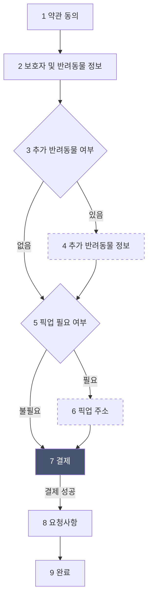

# conditional-step-form

> 실무에서 조건부 다단계 계약 폼을 구현한 경험을 바탕으로, 도메인을 **반려동물 호텔 예약**으로 일반화해 재구현한 예제입니다.
> 실무 코드는 포함하지 않았으며, 문제의 구조만 가져와 빈 프로젝트에서 처음부터 다시 설계하고 구현했습니다.

## 핵심 고민

- 조건부로 건너뛰는 단계와 결제 이후 되돌아가기 제한이 함께 있을 때, 흐름 규칙을 어디에서 관리할 것인가
- 이전 단계의 답이 바뀌면, 그 답에 종속된 입력값은 어떻게 처리할 것인가
- 무엇을 상태로 저장하고, 무엇을 매번 계산할 것인가
- 단계 컴포넌트가 흐름과 검증을 몰라도 되게 하려면 책임을 어떻게 나눌 것인가

각 고민에 대한 결정과 이유는 아래 "설계" 섹션에 정리했습니다.

## 기술 스택

- Next.js (App Router), React, TypeScript
- Tailwind CSS
- Zod (단계별 입력 검증)

## 실행 방법

```bash
npm install
npm run dev
```

브라우저에서 http://localhost:3000 을 열어 확인합니다.

---

## 설계

구현 전에 정리한 설계입니다. 구현하면서 바뀐 내용은 커밋 기록에 남깁니다.

### 1. 단계 흐름



- 점선 단계(4, 6)는 이전 단계의 답에 따라 건너뛸 수 있는 **조건부 단계**입니다.
- 7 결제가 성공한 이후에는 **결제 이전 단계로 돌아갈 수 없습니다.**
- 9 완료 화면에서는 이전 버튼을 보여주지 않습니다.

### 2. 단계별 입력값과 통과 조건

| 단계 | 입력값 | 통과 조건 |
|---|---|---|
| 1 약관 동의 | 동의 여부 | 동의가 true |
| 2 보호자 및 반려동물 정보 | 보호자 이름, 연락처, 반려동물 이름, 종류, 몸무게, 체크인 날짜, 체크아웃 날짜 | 보호자 이름 2자 이상, 연락처 010-0000-0000 형식, 반려동물 이름, 종류, 몸무게(0 초과) 입력, 체크인은 오늘 이후, 체크아웃은 체크인보다 뒤 |
| 3 추가 반려동물 여부 | 있음 또는 없음 | 선택 완료 (초기값 null) |
| 4 추가 반려동물 정보 | 반려동물 목록 (이름, 종류, 몸무게, 특이사항) | 1마리 이상, 각 마리의 이름, 종류, 몸무게 입력 (특이사항은 선택) |
| 5 픽업 필요 여부 | 필요 또는 불필요 | 선택 완료 (초기값 null) |
| 6 픽업 주소 | 주소, 희망 픽업 시간 | 주소와 희망 픽업 시간 입력 |
| 7 결제 | 결제 수단 | 결제 수단 선택 후 결제 성공 시 이동, 실패 시 머무르며 에러 표시 |
| 8 요청사항 | 요청사항 | 조건 없음 (선택 입력) |
| 9 완료 | 없음 | 예약 내용 요약 표시 |

통과 조건은 단계마다 Zod 스키마로 정의하고, 입력 타입도 같은 스키마에서 만들어 검증과 타입이 항상 일치하도록 합니다.

### 3. 상태로 두는 것과 계산하는 것

**기준: 다른 상태로부터 언제나 정확히 계산할 수 있으면 저장하지 않고, 실제로 일어난 사건이라 다른 값으로 알 수 없으면 저장한다.**

| 구분 | 항목 | 이유 |
|---|---|---|
| 상태 | 현재 단계 | 사용자가 지금 어디에 있는지는 다른 값으로 알 수 없음 |
| 상태 | 예약 입력 데이터 | 사용자가 입력한 값 |
| 상태 | 결제 완료 여부 | 결제 성공이라는 사건이 있어야만 알 수 있음 |
| 계산 | 결제 금액 | 숙박 일수, 반려동물 수, 픽업 여부로 항상 계산 가능 |
| 계산 | 현재 단계 통과 가능 여부 | 현재 단계 데이터와 스키마로 항상 계산 가능 |
| 계산 | 이전으로 갈 수 있는지 여부 | 현재 단계와 결제 완료 여부로 항상 계산 가능 |

### 4. 설계 결정

**예, 아니요 질문의 초기값은 null로 둔다.**
초기값을 false로 두면 사용자가 아무것도 고르지 않은 상태와 "없음"을 고른 상태를 구별할 수 없어, 선택하지 않고도 다음 단계로 넘어갈 수 있게 됩니다. 그래서 선택 안 함(null), 있음(true), 없음(false) 세 가지 상태로 둡니다.

**"있음"을 "없음"으로 바꾸면 종속된 입력값을 지운다.**
3단계에서 "있음"을 골라 4단계 정보를 입력한 뒤 다시 "없음"으로 바꾸면, 4단계에서 입력한 반려동물 목록을 지웁니다. 지우지 않으면 "추가 반려동물 없음"인데 목록에는 반려동물이 남아 있는, 있을 수 없는 상태가 만들어집니다. 이 모순은 결제 금액을 목록 기준으로 계산할 때 "없음"을 골랐는데도 추가 요금이 붙는 식의 버그로 이어질 수 있습니다. 데이터가 항상 사용자가 화면에서 고른 내용과 일치하도록, 있을 수 없는 상태는 아예 만들어지지 않게 합니다. 5단계와 6단계의 관계도 같습니다. 실수로 "없음"을 눌러 입력한 정보를 잃는 문제는 삭제 전 확인 창으로 보완하는 방안을 검토합니다.

**결제 완료 여부는 현재 단계로 추론하지 않고 별도 상태로 둔다.**
"현재 단계가 결제 이후인가"로도 결제 여부를 추론할 수 있지만, 이는 결제를 통과해야만 다음 단계로 갈 수 있다는 흐름 순서에 기댄 가정입니다. 흐름 순서가 바뀌거나 단계를 복원하고 건너뛰는 기능이 생기면 이 가정은 에러 없이 조용히 깨집니다. 결제 완료는 실제로 일어난 사건이므로 별도 상태로 둡니다.

**통과 조건을 만족하지 못하면 버튼을 비활성화한다.**
입력 조건이 단순해 사용자가 무엇을 채워야 하는지 쉽게 알 수 있으므로, 항목별 에러 메시지 없이 버튼 비활성화만으로 충분하다고 판단했습니다. 연락처처럼 형식이 헷갈릴 수 있는 입력창에는 안내 문구를 넣습니다.

### 5. 컴포넌트 구조

```
useBookingFlow (커스텀 훅)
  가지고 있는 것: 현재 단계, 예약 입력 데이터, 결제 완료 여부
  제공하는 것: 데이터 바꾸기, 다음으로, 이전으로, 이전 가능 여부, 현재 단계 통과 가능 여부
        │
        ▼
BookingPage (페이지)
  훅을 한 번 호출하고, 현재 단계에 맞는 컴포넌트를 골라 그림
        │
        ├─ StepLayout (공통 레이아웃): 이전 버튼과 주 버튼
        │
        └─ 현재 단계 컴포넌트
             자기 단계의 데이터만 받고, 값이 바뀌면 알리기만 함
```

**useBookingFlow**
흐름 규칙(조건부 건너뛰기, 결제 이후 되돌아가기 제한, 단계별 통과 판단)을 모두 담당합니다. 페이지는 훅이 제공하는 값과 함수만 사용하고, 규칙의 내부는 알지 못합니다.

**단계 컴포넌트**
- 자기 단계에 필요한 데이터만 받고, 값이 바뀌면 부모에게 알리기만 합니다. 상태를 직접 갖지 않습니다.
- 상태를 단계 컴포넌트 안에 두면 다음 단계로 넘어가는 순간 컴포넌트와 함께 사라져, 이전으로 돌아왔을 때 입력값이 비게 됩니다. 그래서 데이터는 화면에서 사라지지 않는 훅에 둡니다.
- 예외: 결제 단계는 전체 데이터 대신 페이지에서 계산한 **결제 금액**만 받고, 완료 단계는 예약 전체를 요약해야 하므로 **전체 데이터**를 받습니다.

**StepLayout**
- 모든 단계가 공통으로 쓰는 레이아웃으로, 이전 버튼과 주 버튼을 가집니다.
- 주 버튼은 **버튼 글자, 눌렀을 때 할 일, 비활성화 여부, 로딩 중 여부**를 받습니다. 그래서 일반 단계의 "다음"과 결제 단계의 "결제하기"를 같은 레이아웃으로 처리합니다.
- 비활성화 여부는 훅이 계산한 "현재 단계 통과 가능 여부"를 페이지가 그대로 전달합니다. 단계 컴포넌트는 검증을 알 필요가 없습니다.

---

## 검증 시나리오

1. 추가 반려동물 없음, 픽업 불필요를 고르면 1 → 2 → 3 → 5 → 7 → 8 → 9 순서로 진행된다.
2. 추가 반려동물 없음 상태에서 5단계에서 이전을 누르면 4단계가 아닌 3단계로 이동한다.
3. 결제 성공 후 8단계에서 이전 버튼이 보이지 않는다.
4. 단계를 오가도 앞에서 입력한 값이 유지된다.
5. 3단계에서 "있음"을 골라 4단계를 입력한 뒤 3단계로 돌아가 "없음"으로 바꾸면, 4단계 입력값이 지워지고 이후 흐름에서 4단계를 건너뛴다.
6. 결제에 실패하면 결제 단계에 머무르며 에러를 보여준다.
7. 9단계 완료 화면에서는 이전 버튼이 보이지 않는다.
